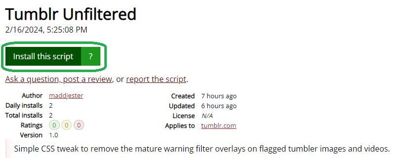
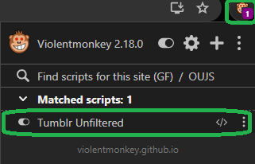

# Tumblr: Unfiltered

## Table of Contents

- [About](#about)
- [Getting Started](#getting_started)
- [Installation](#installing)
- [Usage](#usage)
- [Contributing](../CONTRIBUTING.md)

## About 

A Tumblr tweak/mod userscript for media items that are tagged for mature audiences that will hide the annoying mature content warnings and buttons.

## Getting Started 

These instructions will get you a copy of the project up and running on your local machine for development and testing purposes.

### Prerequisites

- It is recommended to install a userscript manager extension for your browser. Note: script was written and tested with Violentmonkey which can be obtained from the link below.

[Violentmonkey: Get It Here](https://violentmonkey.github.io/get-it/)

- Follow the link to install the stable branch of the extension for the specific **web browser** you are using.

### Installing

- Visit **GreasyFork** to install:

[GreasyFork - Tumblr: Unfiltered](https://greasyfork.org/en/scripts/487478-tumblr-unfiltered)

- Click on the **Install** button to add the script to your extension.

## Usage 
- Installation is complete if you want to verify it is installed or if you want to remove or disable the script just click the extension icon in the menu bar of your browser to change or modify the settings at any time. 